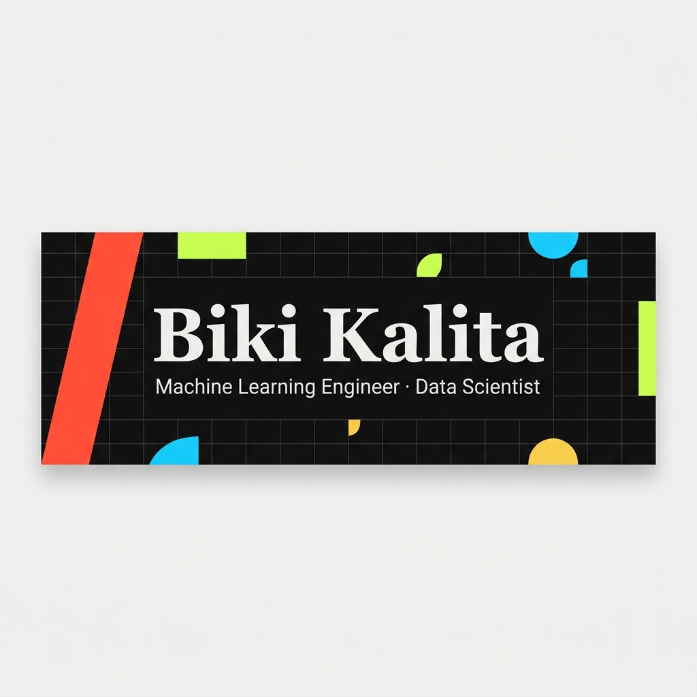

# GitHub Profile README

> **Note:** Replace `banner.png` with your own banner image in the
> repository root.

```{=html}
<!-- ══════════════════════════════════════════════════════════════════════════ -->
```
```{=html}
<!--  B I K I   K A L I T A  ·  GitHub Profile README                       -->
```
```{=html}
<!-- ══════════════════════════════════════════════════════════════════════════ -->
```
::: {align="center"}


``{=html}

`<br>`{=html}


:::

## 👋 About Me

I'm **Biki Kalita**, a Computer Science student passionate about
**Machine Learning**, **Deep Learning**, **NLP**, **Computer Vision**,
and **Neuro-Symbolic AI**.

-   🔬 Researching intelligent AI systems
-   🚀 Building end-to-end ML applications
-   📚 Exploring LLMs & Small Language Models
-   🌱 Open Source Contributor

------------------------------------------------------------------------

## 🌐 Connect

::: {align="center"}
[](mailto:bikikalitaxtra@gmail.com)
[](https://www.linkedin.com/in/biki-kalita-1b9807394)
[](https://github.com/Biki989)
[](https://bikikalita.com)
:::

------------------------------------------------------------------------

# 🟩 Tech Stack

```{=html}
<p align="center">
```
``{=html}
```{=html}
</p>
```

------------------------------------------------------------------------

# 📊 GitHub Analytics

::: {align="center"}
``{=html}

``{=html}
:::

------------------------------------------------------------------------

# 🔥 GitHub Streak

::: {align="center"}
``{=html}
:::

------------------------------------------------------------------------

# 🏆 GitHub Trophies

::: {align="center"}
``{=html}
:::

------------------------------------------------------------------------

# 📈 Contribution Graph

::: {align="center"}
``{=html}
:::

------------------------------------------------------------------------

# 🐍 Contribution Snake

::: {align="center"}
``{=html}
:::

------------------------------------------------------------------------

::: {align="center"}
``{=html}
:::

------------------------------------------------------------------------

## 📫 Open to Work

Machine Learning • AI Research • Deep Learning • Backend AI Systems

::: {align="center"}
⭐ If you like my work, consider starring my repositories!
:::


